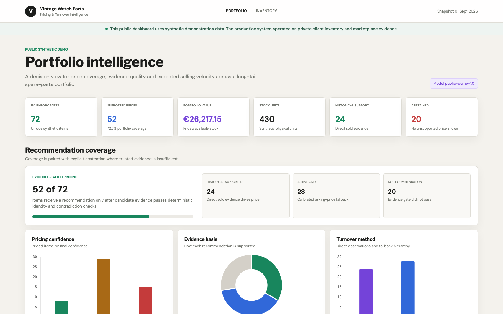
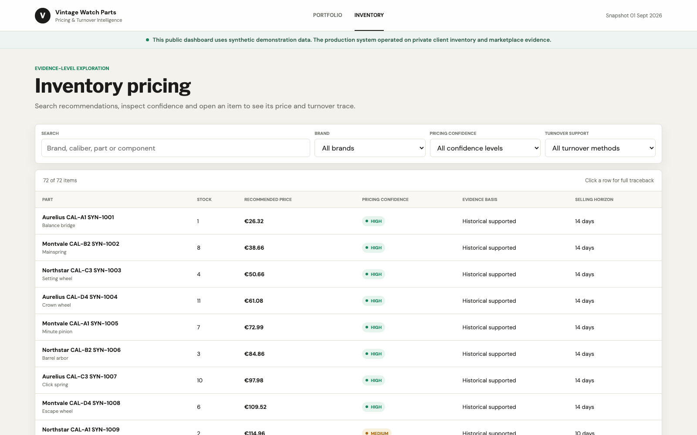
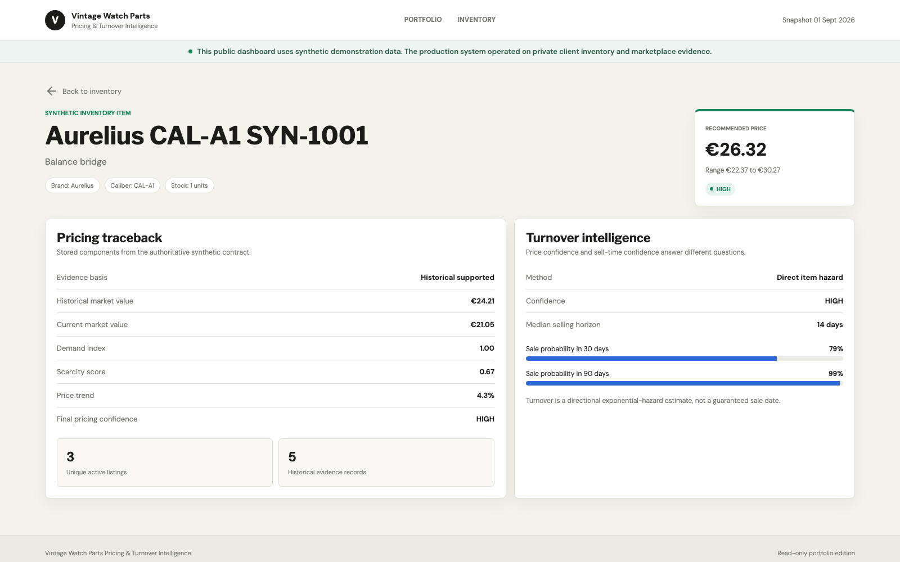
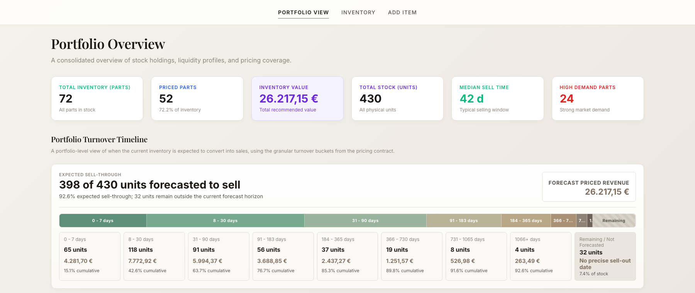
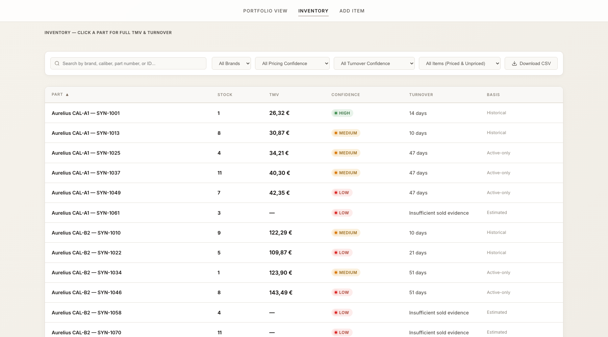
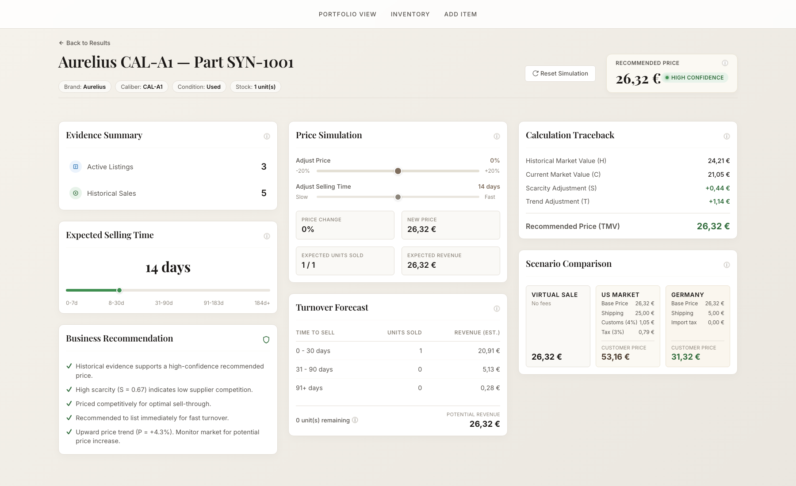

# Vintage Watch Parts Pricing & Turnover Intelligence

An evidence governed analytics product that turns sparse marketplace observations into explainable price recommendations, uncertainty ranges and directional selling horizons.



[Live Dashboard](https://vaish1101.github.io/vintage-watch-parts-pricing-turnover-intelligence/) | [Architecture](docs/architecture.md) | [Methodology](docs/methodology.md) | [Reproduction](docs/reproduction.md)

> **Public synthetic demo:** The dashboard and sample pipeline in this repository use intentionally fabricated inventory and evidence. Private client inventory, raw marketplace records, credentials and the operational database are not published.

## Audited private project snapshot

These privacy safe aggregates were queried again from the authoritative private dashboard contract. They are not counts from the synthetic demo.

| Outcome | Audited value |
|---|---:|
| Eligible positive stock items | 728 |
| Physical stock units | 2,935 |
| Supported price recommendations | 575 |
| Explicit no recommendation outcomes | 153 |
| Historical supported recommendations | 239 |
| Active only recommendations | 336 |
| Aggregate recommended portfolio value | EUR 186,234.91 |

## Business problem

Vintage spare parts trade in thin, fragmented markets. Exact comparable sales can be rare, active listings show asking prices rather than realized prices, the same listing can appear through several searches, and long tail inventory may take months to sell.

The product supports two decisions for every inventory item:

1. What is a defensible selling price recommendation, range and confidence?
2. What selling horizon is supported by observed velocity, and how confident is that estimate?

## Key outcomes

- One authoritative dashboard row per eligible inventory item.
- Historical sold evidence takes precedence over active asking prices.
- Active only recommendations remain visibly separate and lower confidence.
- Pricing and turnover confidence are evaluated independently.
- Weak evidence produces an explicit abstention instead of a fabricated price.
- Every displayed recommendation includes evidence counts, method, timestamp and model version.

## How it works

Built an end to end ETL and analytics pipeline that ingests client inventory and marketplace evidence, cleans and validates sparse product data, stores governed analytical layers in DuckDB, and produces explainable pricing recommendations and turnover estimates through a decision support dashboard.

```text
Sources
        -> Extract and ingest
        -> Transform and data quality
        -> DuckDB analytical layers
        -> Evidence retrieval and validation
        -> Pricing and turnover intelligence
        -> One dashboard row per eligible item
        -> Client decision support dashboard
```

## System architecture


The private operational product uses Python, SQL and DuckDB. The public portfolio edition rebuilds the same analytical concepts from synthetic inputs and serves a frozen JSON contract through a static dashboard.

## Pricing intelligence

Accepted sold evidence produces a recency and volume weighted historical value. If sold evidence is absent, the system uses the median accepted active ask with a 0.79 adjustment. Bounded trend, scarcity and demand terms provide controlled context. Confidence bands widen as evidence weakens.

The repaired retrospective evaluation contains 975 leave one evidence out observations. The model produced EUR 83.50 MAE and EUR 34.17 median absolute error, versus EUR 82.88 and EUR 33.32 for a simple baseline. The result does not establish predictive superiority and is disclosed as a limitation.

[Read the pricing methodology](docs/pricing_methodology.md)

## Turnover intelligence

Turnover follows a transparent fallback hierarchy:

1. direct item hazard;
2. brand and caliber comparable cohort;
3. broader portfolio prior;
4. insufficient sold evidence.

The output includes median selling horizon, 30-day and 90-day probabilities, method and confidence. It is a directional velocity estimate, not a guaranteed sale date.

[Read the turnover methodology](docs/turnover_methodology.md)

## Evidence validation

Retrieval is broad, but evidence acceptance is conservative. Brand, part number, caliber, component type, contradiction terms and stable listing identity are evaluated deterministically.

In a 211 candidate human reviewed development set, the score 0.95 verification tier selected 74 true and 2 false matches across binary labelled cases, equal to 97.4% precision. This is not independent test set accuracy and no ML model is claimed.

## Public demo





The read only dashboard includes portfolio coverage, inventory filters, recommended price and range, pricing confidence, evidence basis and counts, turnover method and confidence, selling horizon, probabilities, no recommendation reasons, data freshness and model version.

## Private operational dashboard

The public demo uses synthetic data and is read only. The private operational dashboard supported live eBay retrieval, DuckDB backed analytics, inventory updates, pipeline execution and item level evidence tracing. The interface screenshots below use synthetic fixtures so no client or marketplace data is exposed. The private dashboard is not publicly accessible.

The views below reproduce the operational interface design with a fully synthetic screenshot fixture. No private database row, marketplace title, seller identity, listing ID, URL or client identifier was rendered or exported.

### Portfolio and turnover workflow



### Inventory pricing workspace



### Item level pricing and turnover trace



## Validation

Public validation covers normalization, identifier preservation, duplicate evidence handling, contradiction rejection, matching confidence, historical first pricing, active only fallback, bounded trend, price ranges, abstention, turnover hierarchy, probability bounds, contract grain, synthetic schema and deterministic generation.

The matching verification aggregate and repaired pricing evaluation are stored in [`evidence/validation_summary.json`](evidence/validation_summary.json).

## Data quality

Raw, staging and client facing grains remain separate in the private design. Stable evidence identities prevent repeated retrieval from inflating comparable counts. Current outputs are scoped to current eligible inventory. The public dataset is generated from fabricated identities rather than anonymized client rows.

[Read the data quality notes](docs/data_quality.md)

## Technology stack

- Python and SQL
- DuckDB in the private operational architecture
- HTML, CSS and vanilla JavaScript
- Chart.js
- pytest
- GitHub Actions and GitHub Pages

## Limitations

- Active only recommendations do not yet have independent realized sale outcome validation.
- The 0.79 adjustment is supported by retrospective same snapshot concordance, not an independent holdout.
- Scarcity and demand weights remain disclosed parameters rather than independently validated causal effects.
- Historical aggregate rows and individual sold records have different source grains.
- Turnover assumes a directional exponential hazard and cannot promise an exact sale date.
- The public dashboard is a frozen synthetic demonstration, not a live market feed.

## Reproduction

The sample pipeline is deterministic, offline and credential free. See [reproduction instructions](docs/reproduction.md).

## Data and privacy

No real client inventory, seller identity, listing ID, marketplace URL, raw listing title, credential or operational database is included. Redistribution rights for raw marketplace content are not assumed.

## License

The authored source code and synthetic demonstration assets are released under the [MIT License](LICENSE). Private client data and marketplace source data are not included or licensed by this repository.
