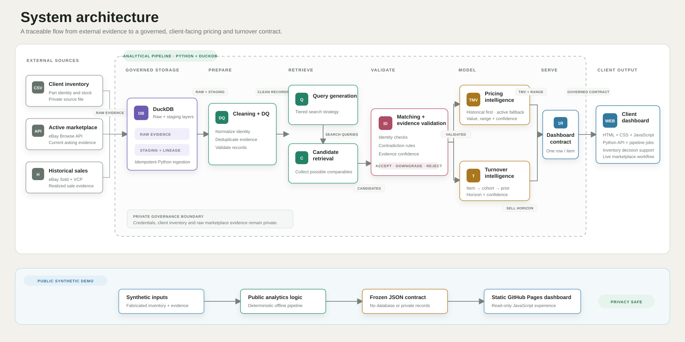

# Architecture

## Private operational product

The production design separates evidence collection, analytical processing and client presentation.

1. Client inventory, active marketplace observations and historical sold evidence enter Python ingestion.
2. File and row identities make raw ingestion repeatable.
3. DuckDB preserves raw and staging layers.
4. Cleaning standardizes identifiers without treating caliber or part number as numeric measures.
5. Tiered queries retrieve possible comparable listings.
6. Deterministic identity and contradiction checks decide which candidates may influence analytics.
7. The pricing and turnover engines publish one client facing row per eligible item.
8. The operational dashboard reads that final contract.

The private system includes credentials, raw marketplace records and client inventory. None of those assets are part of this repository.

## Public portfolio edition

The public edition is deliberately separate. A deterministic local script creates fabricated inventory and evidence records, applies the public analytical modules and writes `dashboard/demo-data.json`. The HTML, CSS and JavaScript dashboard reads only that frozen JSON file.

There is no backend, database, credential, write endpoint or live marketplace connection in the public dashboard.

## Analytical contract

The dashboard contract is the boundary between analytics and presentation. Each eligible item appears once and carries its final price decision, uncertainty range, evidence counts, turnover result, data timestamp and model version. The browser displays these fields without recalculating business logic.

