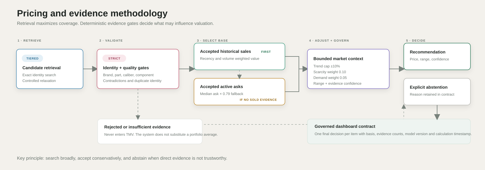

# Methodology

## Retrieval and acceptance are separate

Marketplace retrieval is intentionally broad because rare parts may have very little exact evidence. Broad retrieval does not make every result valid. Candidates pass through deterministic checks before they can influence pricing.

The matching layer checks:

- brand identity;
- part-number token boundaries;
- caliber compatibility;
- component type;
- negative or contradictory terms;
- duplicate evidence identity.

Candidates with a contradiction are rejected. Strong candidates receive an evidence confidence class. The analytical engines consume only accepted evidence classes.

The retrieval layer maximizes coverage, while the validation layer protects pricing from weak, contradictory or duplicated evidence.

## Confidence and abstention

Confidence describes evidence strength, not whether a price looks plausible. Pricing confidence and turnover confidence are separate because active listings can support a price while revealing nothing about completed sale velocity.

If no trustworthy direct evidence is available, the system abstains. It does not substitute a portfolio average and present it as item level evidence.

## Matching verification

The private development review contained 211 human reviewed candidates: 105 true matches, 87 false matches and 19 ambiguous cases. Among the 192 binary labelled observations, a score threshold of 0.95 selected 74 true and 2 false matches, or 97.4% precision. This is development set verification, not independent test set accuracy and not an ML metric.
