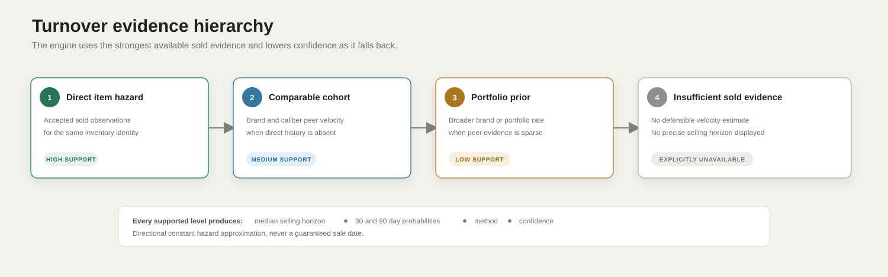

# Turnover methodology

Turnover estimates selling velocity from sold counts and dates. It is not a price elasticity model and it does not promise an exact sale date.

## Fallback hierarchy

1. `DIRECT_ITEM_HAZARD` uses accepted sold observations for the same inventory item.
2. `COMPARABLE_COHORT_HAZARD` uses the brand and caliber cohort when direct item history is absent.
3. `HIERARCHICAL_PORTFOLIO_PRIOR` uses a broader brand or portfolio prior when the direct cohort is too sparse.
4. `INSUFFICIENT_SOLD_EVIDENCE` is shown when no defensible velocity estimate exists.



Each fallback broadens the evidence pool and lowers specificity. The dashboard keeps the selected method and confidence visible instead of presenting every horizon as equally certain.

## Exponential hazard

A recency weighted monthly hazard is derived from sold volume. The dashboard stores:

- median days to sale;
- probability of sale within 30 days;
- probability of sale within 90 days;
- method and confidence.

For monthly hazard `lambda`:

```text
P(sale by t days) = 1 - exp(-lambda x t / 30)
median days = 30 x ln(2) / lambda
```

## Limitations

The exponential model assumes a stable hazard over the displayed horizon. Rare parts, changing market demand, listing quality, condition and seller strategy can violate that assumption. Cohort and portfolio fallback estimates are directional and must remain visibly lower confidence than direct item history.
